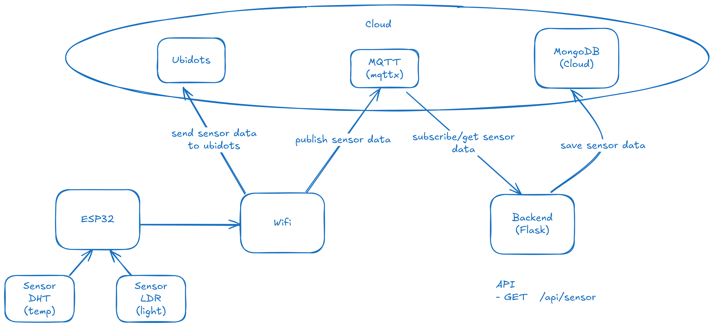

# Skibims IoT Sensor System

Team Code: UNI169
Team Name: skibims

## Overview

This project is an IoT-based sensor system that collects environmental data using an ESP32 microcontroller and transmits it via MQTT to a Flask-based backend, which stores the data in MongoDB.

## Project Structure

```
ASSIGNMENT-2/
│-- backend/
│   ├── env/
│   ├── .env
│   ├── .gitignore
│   ├── requirements.txt
│   ├── server.py
│-- esp32/
│   ├── sensor-code.py
│-- flow-diagram.png
│-- README.md
```

## How All of Them Works Together



## Installation

### Backend

1. Install Python (>=3.8) and set up a virtual environment:
   ```sh
   python -m venv env
   source env/bin/activate  # On Windows use `env\Scripts\activate`
   ```
2. Install required dependencies:
   ```sh
   pip install -r requirements.txt
   ```
3. Set up MongoDB and add the connection string in `.env`:
   ```sh
   MONGO_URI=mongodb+srv://<your_username>:<your_password>@cluster.mongodb.net/
   ```
4. Run the backend server:
   ```sh
   python server.py
   ```

### ESP32 (MicroPython)

1. Install [Thonny IDE](https://thonny.org/).
2. Connect the ESP32 board and flash it with MicroPython (if not already installed).
3. Open `sensor-code.py` in Thonny IDE and upload it directly to the ESP32.
4. Run the script to start data collection.

**Note:** Since we are using MicroPython, there is no need for `esptool` or `ampy`.

## API Endpoints

- `GET /api/sensor` - Retrieve sensor data with optional time filters.
  - Query Parameters:
    - `from`: Start datetime (ISO format)
    - `to`: End datetime (ISO format)

## MQTT Configuration

- **Broker:** `broker.emqx.io`
- **Topic:** `/UNI169/skibims/sensor`

## Ubidots Dashboard

You can view real-time sensor data on the Ubidots dashboard:
[Ubidots Dashboard](https://stem.ubidots.com/app/dashboards/public/dashboard/v02q5tlGfgwALntIENkHAUHqTpQ3TM5382HJWw1rc1Q?navbar=true&contextbar=true&datePicker=true&devicePicker=true&displayTitle=true)

## License

This project is licensed under the MIT License.
